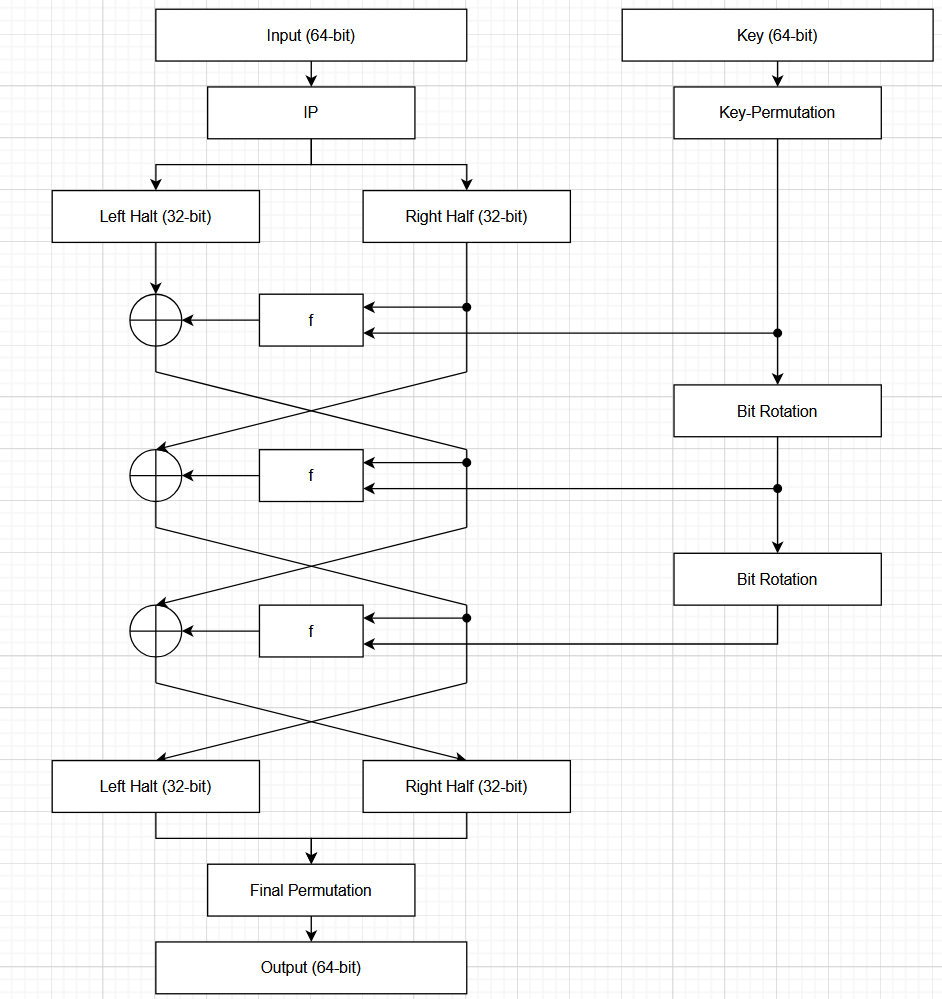
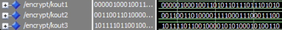

# Bitstream Breach Challenge Writeup

This challenge implements a primitive version of DES encryption. You can start by creating a block diagram of the entire encryption process.


There are only 3 rounds and every f-function appears to simply be another XOR gate.
The encryption process really only swaps the two halves and a couple of XOR gates but the key generation uses a more advanced. The easiest way to get the subkeys is to simulate the design with a random plaintext value.

Since the keystream is not dependent on the plaintext, this will result in the same values every time.

Now that we have the keys, we can begin to reverse the algorithm. Bitstrings in python can be used to reverse it. To begin, there are two permutations: the initial permutation (ip.vhd) and final permutation (fp.vhd).

```python
INITIAL_PERMUTATION = [
    [58, 50, 42, 34, 26, 18, 10, 2],
    [60, 52, 44, 36, 28, 20, 12, 4],
    [62, 54, 46, 38, 30, 22, 14, 6],
    [64, 56, 48, 40, 32, 24, 16, 8],
    [57, 49, 41, 33, 25, 17, 9, 1],
    [59, 51, 43, 35, 27, 19, 11, 3],
    [61, 53, 45, 37, 29, 21, 13, 5],
    [63, 55, 47, 39, 31, 23, 15, 7],
]

FINAL_PERMUTATION = [
    [40, 8, 48, 16, 56, 24, 64, 32],
    [39, 7, 47, 15, 55, 23, 63, 31],
    [38, 6, 46, 14, 54, 22, 62, 30],
    [37, 5, 45, 13, 53, 21, 61, 29],
    [36, 4, 44, 12, 52, 20, 60, 28],
    [35, 3, 43, 11, 51, 19, 59, 27],
    [34, 2, 42, 10, 50, 18, 58, 26],
    [33, 1, 41, 9, 49, 17, 57, 25]
]

```

Define a function to reverse a permutation and a bitwise xor function.
``` python
def reverse_permutation(x, perm_list):
    y = [0]*len(x)
    for i in range(0, len(perm_list)*len(perm_list[0])):
        y[perm_list[i // (len(perm_list[0]))][i % len(perm_list[0])]-1] = x[i]
    y = ''.join(y)
    return y

def xor(a, b):
    return bin(int(a, 2) ^ int(b, 2))[2:].zfill(len(a))
```

Define subkeys from the first steps and our ciphertext.
``` python
key1 = "00000100010011010110111011101010"
key2 = "00110011010000111100011100011100"
key3 = "10111101100100001010100010100110"

#This is 63 downto 0
ciphertext = "0011111010101000101000101100110100111010000111000111110111100010"
ciphertext = ciphertext[::-1]
```
The ciphertext is defined in the simulation software as 63 downto 0 so python indexing would be difficult if we did not reverse the list order.

We then start by reversing the final permutation.
``` python
finalp = reverse_permutation(ciphertext, FINAL_PERMUTATION)
finalp = finalp[::-1]
```

We can then split the ciphertext in two again and move through the rounds.
``` python
#Split the result into two halves
left = finalp[:32]
right = finalp[32:]

#ROUND 3
round3left = xor(xor(left, key3), right)
round3right = left

#ROUND 2
round2left = xor(xor(round3left, key2), round3right)
round2right = round3left

#ROUND 1
round1left = xor(xor(round2left, key1), round2right)
round1right = round2left

ciphertext = round1left + round1right
```

Finally, we can reverse the initial permutation and print out decrypted string as ASCII.
``` python
#Reverse the initial permutation
ciphertext = reverse_permutation(ciphertext, INITIAL_PERMUTATION)

#Convert to ascii
ciphertext = ''.join([chr(int(ciphertext[i:i+8], 2)) for i in range(0, len(ciphertext), 8)])
print(ciphertext)
```

Since the entire flag is 128 bits and this encryption algorithm can only handle 64 bits at a time. We do the first half and uncover ```RS{SYSTE``` then the second half ```M_R3S3T}```.

The final flag is ```RS{SYSTEM_R3S3T}```